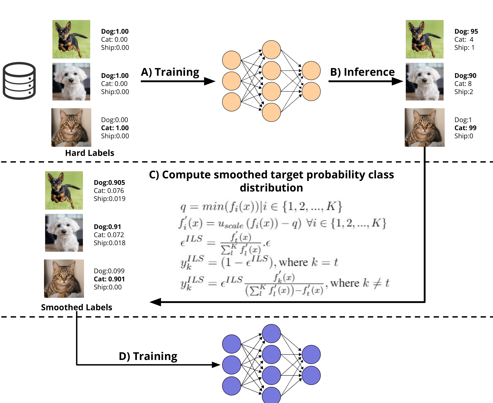

# Instance-based Label Smoothing for Neural Networks
- Pytorch Implementation of the algorithm.
- This repository includes a new proposed method for instance-based label smoothing in neural networks, where the target probability distribution is not uniformly distributed among incorrect classes. Instead, each incorrect class is going to be assigned a target probability that is proportional to the output score of this particular class relative to all the remaining classes for a network trained with vanilla cross-entropy loss on the hard target labels. 

<div style="text-align: center">

</div>

- The following figure summarizes the idea of our instance-based label smoothing that aims to keep the information about classes similarity structure while training using label smoothing.

<div style="text-align: center">

</div>

## Requirements
- Python 3.x
- pandas
- numpy
- pytorch

## Usage

### Datasets
- CIFAR10 / CIFAR100 / FashionMNIST
        
### Files Content
The project have a structure as below:

```bash
├── Vanilla-cross-entropy.py
├── Label-smoothing.py
├── Instance-based-smoothing.py
├── Models-evaluation.py
├── Network-distillation.py
├── utils
│   ├── data_loader.py
│   ├── utils.py
│   ├── evaluate.py
│   ├── params.json
├── models
│   ├── resnet.py
│   ├── densenet.py
│   ├── inception.py
│   ├── shallownet.py
```
`Vanilla-cross-entropy.py` is the file used for training the networks using cross-entropy without label smoothing. <br>
`Label-smoothing.py` is the file used for training the networks using cross-entropy with standard label smoothing. <br>
`Instance-based-smoothing.py` is the file used for training the networks using cross-entropy with instance-based label smoothing. <br>
`Models-evaluation.py` is the file used for evaluation of the trained networks. <br>
`Network-distillation.py` is the file used for distillation of trained networks into a shallow convolutional network of 5 layers. <br>
`models/` includes all the implementations of the different architectures used in our evaluation like <i>ResNet, DenseNet, Inception-V4</i>. Also, the <i>shallow-cnn</i> student network used in distillation experiments.<br>
`utils/` includes all utilities functions required for the different models training and evaluation.<br>

Example
```bash
python Instance-based-smoothing.py --dataset cifar10 --model resnet18 --num_classes 10
```

### List of Arguments accepted for Codes of Training and Evaluation of Different Models:
```--lr``` type = float, default = 0.1, help = Starting learning rate (A weight decay of $1e^{-4}$ is used). <br>
```--tr_size``` type = float, default = 0.8, help = Size of training set split out of the whole training set (0.2 for validation). <br>
```--batch_size``` type = int, default = 512, help = Batch size of mini-batch training process. <br>
```--epochs``` type = int, default = 100, help = Number of training epochs. <br>
```--estop``` type = int, default = 10, help = Number of epochs without loss improvement leading to early stopping. <br>
```--ece_bins``` type = int, default = 10, help = Number of bins for expected calibration error calculation. <br>
```--dataset```, type=str, help=Name of dataset to be used (cifar10/cifar100/fashionmnist). <br> 
```--num_classes``` type = int, default = 10, help = Number of classes in the dataset. <br>
```--model```, type=str, help=Name of the model to be trained. eg: resnet18 / resnet50 / inceptionv4 / densetnet (works for FashionMNIST only). <br> 


## Results

- Results of the comparison of different methods on 3 datasets using 4 different architectures are reported in the following table. <br>
- The experiments were repeated 3 times, and average $\pm$ stdev of log loss, expected calibration error (ECE), accuracy, distilled student network accuracy and distilled student log loss metrics are reported.

<div style="text-align: center">

</div>

- A t-sne visualization for the logits of 3-different classes in CIFAR-10 can be shown below:

<div style="text-align: center">

</div>
